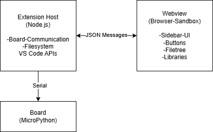

# MicroPython for Arduino - Maintainer Guide

## Setup

### Prerequisites

- Node.js 22.x
- VS Code ^1.109.0
- Python 3.x (required for mpremote and stubs)

### Getting Started

```bash
npm install
npm run compile
```

Press **F5** in VS Code to launch the extension in a new Extension Development Host window.

## Architecture Overview



The extension consists of two isolated parts: the **Extension Host** (Node.js) and the **Webview** (browser sandbox). Since they cannot access each other directly, all communication happens exclusively through typed JSON messages. The Extension Host has access to VS Code APIs, the file system, and the serial board connection. The Webview is responsible for rendering the sidebar UI.

All message types are defined in `src/types/messages.ts`.

### Messages: Webview → Extension

| Category        | Examples                               |
| --------------- | -------------------------------------- |
| Connection      | `getPorts`, `openPort`, `closePort`    |
| Board actions   | `runFile`, `stopFile`, `softReset`     |
| Workspace files | `ws_openFile`, `ws_delete`, `ws_move`  |
| Board files     | `bf_openFile`, `bf_delete`, `bf_move`  |
| Mount           | `toggleMount`                          |
| Libraries       | `installLibrary`, `getLibraries`       |
| Code support    | `activateCodeSupport`, `generateStubs` |

### Messages: Extension → Webview

| Category       | Examples                              |
| -------------- | ------------------------------------- |
| Initialization | `init`                                |
| Board status   | `boardState`, `ports`, `disconnected` |
| Workspace tree | `workspaceFiles`, `ws_nodeCreated`    |
| Board tree     | `boardFiles`, `bf_nodeDeleted`        |
| Libraries      | `installedLibraries`, `installResult` |
| Code support   | `codeSupport`                         |

### Adding a New Board Operation

Every operation that accesses the board must go through `withBoard()` in `src/device/DeviceManager.ts`. It ensures exclusive serial port access by blocking concurrent calls. If you implement a new board operation without using `withBoard()`, you risk opening the serial port while another operation already holds it.

### Adding a New Message

1. Add the type to `src/types/messages.ts` (`WebviewMessage` or `ExtensionMessage`)
2. Implement the handler in `src/webview/handlers/`
3. Register it in `src/webview/SidebarProvider.ts` via `gateway.register(...)`
4. Send and receive it in `media/sidebar/modules/`

---

## Features

### Connecting a Board

When the user selects a port in the sidebar, the `ConnectionManager` creates a `DeviceManager` instance for that port. The extension then loads the board files and installed libraries from the board and displays them in the sidebar. In the background, board-specific code support packages are installed automatically.

**Entry point:** To add a new board, add an entry to `KNOWN_BOARDS` in `src/device/ConnectionManager.ts` with the VID:PID, board name, and stub package name (available at [micropython-stubs.readthedocs.io](https://micropython-stubs.readthedocs.io)).

```typescript
"xxxx:yyyy": {
    name: "Manufacturer Board Name",
    stubPackage: "micropython-<port>-stubs",
},
```

The VID:PID can be found via Device Manager (Windows) or `lsusb` (Linux/Mac).

---

### Library Installation

The user selects a library from the sidebar. The extension invokes the external `upy-package` process, which installs the library directly on the board. Afterwards, a manifest (`/lib/manifest.json`) on the board is updated to track all installed libraries. The sidebar then shows the updated list.

The manifest solves a key problem: `upy-package` places all library files into a flat folder, losing track of which files belong to which library. Without the manifest, uninstalling a library would be impossible. The manifest stores the installed files per library:

```json
{
  "packages": {
    "Arduino Modulino": {
      "url": "https://github.com/arduino/arduino-modulino-mpy",
      "displayName": "Arduino Modulino",
      "installedAt": "2026-04-10",
      "files": ["lsm6dsox.mpy", "micropython_hs3003", "modulino"],
      "version": "1.1.0"
    }
  }
}
```

There is no update mechanism. If a newer version of a library exists, the user must manually uninstall and reinstall it. The extension has no way to detect that an update is available.

**Entry point:** Library installation and uninstallation logic is in `src/device/operation/LibraryOperations.ts`. Manifest read/write is in `src/device/operation/ReadManifestOperation.ts` and `src/device/manifest.ts`.

---

### Code Support

When the user activates code support, the extension reads the manifest from the board to determine which libraries are installed. The source files of those libraries are downloaded from GitHub and stored locally in the workspace under `.mpy_codesupport/`. The Pylance configuration (`.vscode/settings.json`) is then updated so that autocomplete and type checking work on board libraries. Each library gets its own entry in `python.analysis.extraPaths`. Board-specific stubs are installed via `pip` on board connect and referenced via `python.analysis.stubPath`.

Note: Libraries with an empty URL in the manifest (e.g. built-in modules like `zlib`) have no downloadable source. No code support is generated for these.

**Entry point:** GitHub source fetching is in `src/stubs/StubGenerator.ts`. Pylance configuration is managed in `src/stubs/PylanceConfig.ts`.

---

### Mount

Mount binds the local workspace directly onto the board, so scripts can be executed without uploading them first. Mount runs via `mpremote` in a separate VS Code terminal. On deactivation, `main.py` is renamed back. `mpremote` is automatically installed via `pip` when the extension is first activated.

On activation, `main.py` on the board is renamed to `mainWhileMount.py`. This is an `mpremote` limitation: `mpremote` cannot start a mount session if `main.py` already exists on the board. There is no workaround for this; the rename is mandatory.

The following restrictions apply while mount is active:

- Board file operations (read, write, delete) are disabled
- Library installation is disabled
- VS Code must not be closed while mount is active. The `mpremote` process continues running in the background and blocks the serial port. On the next VS Code launch, the port will be blocked until `Ctrl-X` is pressed manually in the terminal
- Mount must be deactivated via the toggle button or `Ctrl-X` in the terminal. If the terminal is forcefully closed, the extension attempts to clean up mount automatically

**Why graceful shutdown cannot be caught:** VS Code terminates all terminals before calling the `deactivate()` hook in `src/extension.ts`. Since the mount process runs inside a terminal, it is already killed by the time `deactivate()` is invoked. A clean unmount is therefore not possible. VS Code provides no API that would allow the extension to run cleanup before terminals are shut down. This is a VS Code platform limitation with no known programmatic workaround.

**Entry point:** Mount logic is in `src/device/MountManager.ts` and `src/device/operation/ActivateMountOperation.ts`.

---

### Workspace File Tree

The workspace file tree is built by reading the local filesystem recursively with Node.js `fs.readdirSync`. The following directories are always excluded from the tree: `node_modules`, `.git`, `__pycache__`, `dist`, `out`, `.vscode`, and `.board_cache`. The result is a `FileNode` tree where each node's `id` is the absolute file path on disk. This path is passed directly to all file operations (open, rename, delete, move, upload). Folders appear before files; both are sorted alphabetically within each level.

**Entry point:** `src/webview/handlers/WorkspaceFileHandler.ts`, function `buildWorkspaceTree`.

---

### Board File Cache

When a board file is opened, it is downloaded to the local `.board_cache/` folder and opened as a normal file in VS Code. This allows Pylance and autocomplete to work on board files. Changes are uploaded directly to the board with `Ctrl+S`. When the editor tab is closed, the local copy is automatically deleted.

**Entry point:** The entire board file cache is implemented in `src/webview/handlers/BoardFileSystemProvider.ts`.

---

### Running Scripts & REPL

The user can run scripts directly from the workspace or from the board. Output is streamed live to a VS Code terminal. Stop interrupts a running script; Soft Reset restarts MicroPython on the board. The interactive REPL opens a VS Code terminal with direct access to the board's Python console.

When running scripts, the behaviour differs depending on what is being run and whether mount is active:
- **Workspace file (without mount):** The file's source code is read locally and sent directly to the board via the Raw REPL protocol as a string. No file is uploaded to the board.
- **Workspace file (with mount):** The file is executed via the active mount REPL using paste mode: `exec(open("relative/path").read())`. If the file is outside the mounted folder, the source code is sent as a code block instead.
- **Board file:** A short Python snippet is sent via Raw REPL that reads and executes the file from the board's own filesystem: `exec(open(path).read(), globals())`.

**Entry point:** Script execution is in `src/device/operation/RunFileOperation.ts` and `src/device/operation/RunCodeOperation.ts`. The REPL is implemented in `src/device/ReplTerminal.ts`.

---

## Architecture Decisions

**Why micropython.js?**
micropython.js is Arduino's official library for serial communication with MicroPython boards. It implements the Raw REPL protocol and file system operations. Implementing this from scratch would have been significant effort.

**Why mpremote for mount?**
mpremote implements the mount protocol natively. A direct serial implementation would be complex and error-prone.

**Why `.board_cache/` instead of a virtual filesystem?**
Real local files allow Pylance/Pyright to resolve types and provide autocomplete. A virtual filesystem would not be recognized by Pylance.

**Why the `withBoard()` pattern?**
The serial port is an exclusive resource, only one operation can hold it at a time. `withBoard()` ensures that no two operations open the port simultaneously. Every board operation must go through this pattern. It is implemented in `src/device/DeviceManager.ts`.

---

## CI/CD Pipeline

The project uses GitLab CI (`gitlab-ci.yml`). The following stages run on every push:

| Stage   | Jobs                               | What it does                                          |
| ------- | ---------------------------------- | ----------------------------------------------------- |
| build   | `install_dependencies`             | `npm ci`                                              |
| test    | `unit_tests`, `integration_tests`  | Jest unit and integration tests                       |
| metrics | `quality_linting`, `quality_jscpd` | `typecheck`, `lint`, `prettier`, duplicate code check |
| package | `package_extension`                | Builds `.vsix`, only on `main` branch or git tag      |
| release | `create_release`                   | Creates a GitLab release, only on git tag             |

Before opening a merge request, make sure `typecheck`, `lint` and `prettier` pass locally. These are the most common CI failures.

To publish a release, create a git tag. The pipeline will build the `.vsix`, upload it to the GitLab package registry, and create a release automatically.

---

## Testing

### Unit Tests

```bash
npm run test:unit
```

Tests are in `src/test/unit/`. Mocks for `vscode` and `micropython.js` are defined in `__mocks__/`.

### Integration Tests

```bash
npm run test        # runs unit tests and integration tests
```

Integration tests are in `src/test/integration/`. Unlike unit tests, they use real file system operations and no `fs` mocks. They do not require a physical board.

### Manual Testing

Launch the extension with **F5** and connect a physical board.

---

## Known Issues

**Mount and closing VS Code**
If VS Code is closed while mount is active, the `mpremote` process continues running in the background and blocks the serial port. On the next launch, the port is unavailable until `Ctrl-X` is pressed manually in the terminal.

**Shared library dependencies and transitive dependencies**
Both problems stem from the diff-based file detection used during installation: the extension determines which files a library installed by comparing the board filesystem before and after running `upy-package`.

- **Shared dependencies:** If lib1 and lib2 both depend on lib3, lib3 is only recorded in lib1's manifest entry (the first installer). Uninstalling lib1 removes lib3 from the board even though lib2 still needs it. A correct fix would require reference counting per file.

- **Transitive dependencies and code support:** If lib1 installs lib3 as a dependency, lib3 gets no manifest entry and therefore no code support. If the user later tries to install lib3 explicitly to generate code support, the diff detects no new files (they already exist) and creates no manifest entry. Code support for lib3 remains unavailable.

A long-term fix requires explicit dependency tracking in the manifest so that transitively installed libraries are recorded with their own entries.

