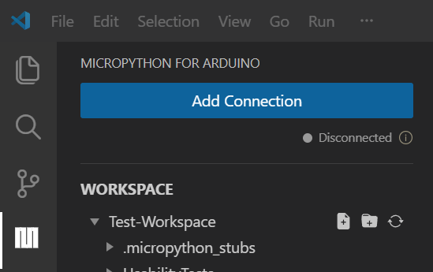
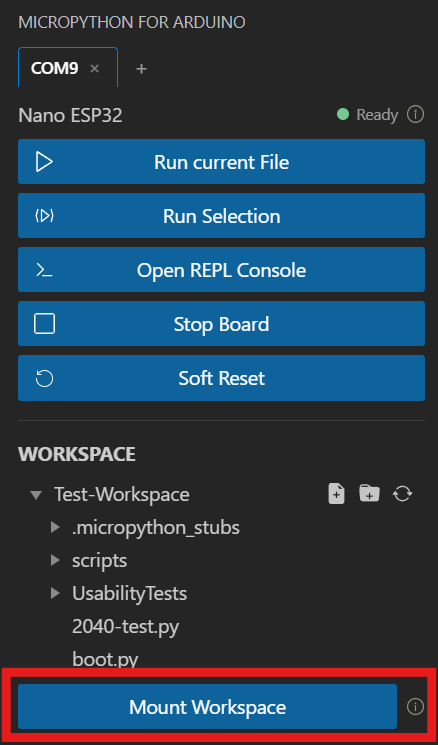
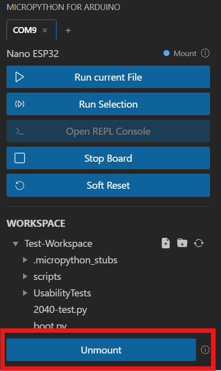

# MicroPython for Arduino

A VS Code extension for MicroPython development on Arduino boards. Developed as a bachelor's thesis at OST – Eastern Switzerland University of Applied Sciences.

## Supported Boards

- Arduino Nano ESP32
- Arduino Nano RP2040 Connect
- Arduino Giga R1

## Requirements

- VS Code
- Python 3.x (must be available on your PATH)
- `mpremote` — installed automatically by the extension on first use, or manually: `pip install mpremote`

## Getting Started

### 1. Open the Extension

After installing, look for the **MicroPython for Arduino** icon in the VS Code Activity Bar (the icon column on the far left). Click it to open the sidebar panel.

### 2. Connect to Your Board

1. Plug your Arduino board into your computer via USB.
2. In the sidebar, select your board's serial port from the dropdown.
3. Click **Connect**. Supported boards are detected automatically by their USB IDs.

### 3. Run a Script

1. Open a `.py` file in VS Code.
2. Click **Run current File** in the sidebar.
3. Script output appears live in the **Output** panel (`View → Output`, then select _MicroPython_ in the dropdown).

## Features

### Run Scripts

- **Run current File**: runs the currently open `.py` file directly on the board
- **Run Selection**: runs the selected code snippet without saving a file
- Script output is streamed live to the VS Code Output panel

### Control the Board

- **Stop Board**: interrupts a running script (sends Ctrl+C)
- **Soft Reset**: restarts the MicroPython runtime without physically disconnecting the board
- **Open REPL Console**: opens an interactive Python terminal connected to the board

### Board File System

- Browse files and folders on the board
- Open a board file in VS Code, edit it locally, and upload it back with the upload button
- Rename, delete, and create files directly on the board

### Mount Workspace

**Mount Workspace** connects your local VS Code workspace folder directly to the board's filesystem using `mpremote`. While mounted, files you save locally are immediately visible and executable on the board, no manual upload step needed.

**How to use:**

1. Click **Mount Workspace** in the sidebar. A terminal opens and the board connects in REPL mode.
2. Run files or interact with the REPL directly in that terminal.
3. When done, click **Unmount** (the same button) to cleanly disconnect.

<table>
  <tr>
    <td></td>
    <td></td>
  </tr>
</table>

**While mount is active:**

- **Library install and uninstall are disabled.** To manage libraries, unmount first.
- The standalone REPL button is disabled (the mount terminal already provides a REPL).
- You can still Stop and Soft Reset the board from the sidebar.

> **Why is Library disabled during mount?** The mount session occupies the serial connection exclusively. Library installation requires its own serial communication, so both cannot run at the same time. Unmount first, install your libraries, then mount again.

### Manage Libraries

- Search and install packages from the Arduino package index
- View and uninstall installed libraries
- Install custom packages via GitHub URL (e.g. `github:user/repo@v1.0.0`)

### Code Support (Autocomplete)

- Set up board-specific MicroPython module stubs (`machine`, `network`, etc.) for Pylance/Pyright
- Generate type hints and autocomplete for installed libraries

### AI Support

- Open Chat with instructions for Library and Board Code
- If you're using another AI that has access to your workspace, make sure to add `.mpy_codesupport/ai-instructions.md` to the context for better results.
- AI with no access to workspace: add context (which board, sensors, libraries and your goal)

## Extension Settings

| Setting                                                    | Default | Description                                                                                                    |
| ---------------------------------------------------------- | ------- | -------------------------------------------------------------------------------------------------------------- |
| `beta-micropython-for-arduino.autoInstallBoardCodeSupport` | `true`  | Automatically installs board-specific code support (autocomplete and type hints) when a board port is selected |

## Troubleshooting

**`mpremote` not found / installation fails**
Run `pip install mpremote` manually in your terminal, then reload VS Code.

**Python not found**
Make sure Python is installed and added to your system PATH. You can verify with `python --version` in a terminal.

## Release Notes

### 0.0.1

Initial release.
