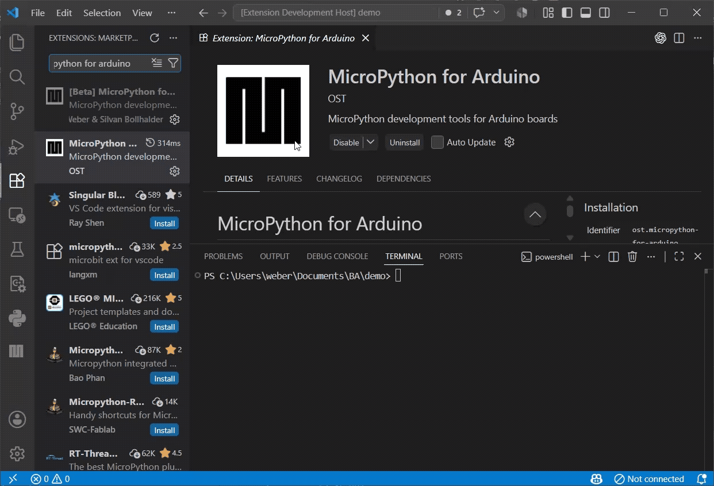

# MicroPython for Arduino

Simple to use MicroPython extension for Arduino microcontrollers.

## Requirements

- Python 3.x (must be available on your PATH) [Install](https://www.python.org/downloads/)

## Getting Started 

1.  Open MicroPython for Arduino sidebar
2.  **Connect** your microcontroller
3.  Open local file
4.  **Run current file**

1.  Open REPL Console for direct communication
2.  Soft Reset to restart the board and execute main.py if available
3.  <strong>Doubleclick Boardfile to edit</strong>
4.  Ctrl+S or Save Button to upload your changes

1.  Files with local dependencies don't run on the board
2.  **Mount Workspace** connects board to local workspace
3.  Execute Soft Reset after changes in local dependencies

1.  Install library
2.  Use library with code completion

## Supported Boards

- Arduino Nano ESP32
- Arduino Nano RP2040 Connect
- Arduino Giga R1

## Dependencies

- `micropython.js` serial communication - [Github Repository](https://github.com/arduino/micropython.js)
- `upy-packager` library installation - [Github Repository](https://github.com/arduino/upy-packager)
- `mpremote` mount - [Docs](https://docs.micropython.org/en/latest/reference/mpremote.html)
- `pylance` IntelliSense - [VS Code Extension](https://marketplace.visualstudio.com/items?itemName=ms-python.vscode-pylance)

## Features

### Run Scripts

- **Run current File**: runs the currently open `.py` file directly on the board
- **Run Selection**: runs the selected code snippet
- Input and Output via Terminal

### Control the Board

- **Stop Board**: interrupts a running script (sends Ctrl+C)
- **Soft Reset**: restarts the MicroPython runtime without physically disconnecting the board (sends Ctrl+D)
- **Open REPL Console**: opens an interactive Python terminal connected to the board

### Board File System

- Browse files and folders on the board
- Open a board file (doubleclick) in Editor, edit it locally, and upload it back with the upload button or save command
- Rename, delete, and create files directly on the board
- Drag and drop move

### Workspace

- Shows workspace with most important actions
- Drag and drop move

### Concurrent Boards

- Extension allow multiple connections
- Connections handled via tabs. **+** connect, **x** disconnect
- Switch tab to access other board

### Mount Workspace

- **Mount Workspace** connects your local VS Code workspace folder directly to the board's filesystem using `mpremote mount`. 
- While mounted, files you save locally are immediately visible and executable on the board, no manual upload step needed.

**How to use:**

1. Click **Mount Workspace** in the sidebar. A terminal opens and the board connects in REPL mode.
2. Run files or interact with the REPL directly in that terminal.
3. When done, click **Unmount** (the same button) to cleanly disconnect.

**While mount is active:**

- **Boardfile actions, Library install and uninstall are disabled.** To manage libraries, unmount first.
- **Soft Reset** will remount the workspace and remove already imported dependencies.

### Manage Libraries

- Search and install packages from the Arduino package index
- View and uninstall installed libraries
- Install custom packages via GitHub URL (e.g. `github:user/repo@v1.0.0`)

### Code Support (Autocomplete)

- Set up board-specific MicroPython module stubs (`machine`, `network`, etc.) for Pylance/Pyright
- Generate type hints and autocomplete for installed libraries
- Overview over library code support in current workspace
- Regenerate Code Support in your workspace for current board

### AI Support

- **GitHub Copilot** and **Claude Code** are supported. 
- Can be activated in extension settings. 
- `.github/copilot-instructions.md` is automatically generated with instructions on how to find dependencies that are in the current workspace. 
- For other AIs just copy the generated instructions into their instruction file.

## Troubleshooting

**`mpremote` not found / installation fails.**
Run `pip install mpremote` manually in your terminal, then reload VS Code.

**Python not found.**
Make sure Python is installed and added to your system PATH. You can verify with `python --version` in a terminal.

**Win 32 ARM64 does not work.**
Install the x64 version of Visual Studio Code to use this extension.

## Extension Settings

| Setting                                               | Default | Description                                                                                                    |
| ---------------------- | ------- | -------------------------------------------------------------------------------------------------------------- |
| Auto Install Board Code Support | `true`  | Automatically installs board-specific code support (autocomplete and type hints) when a board port is selected |
| Generate CLAUDE.md | `false`  | Generates instructions for Claude Code if true |
| Generate Copilot instructions | `true`  | Generates instructions for Github Copilot if true |

